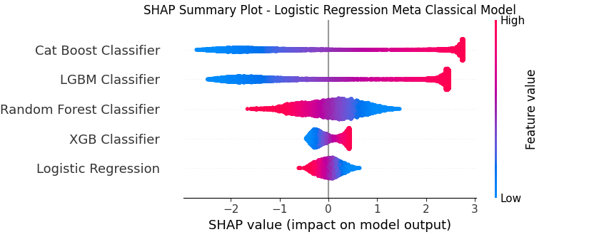

A comprehensive machine learning system for predicting loan default risk with real-time prediction capabilities and explainable AI using SHAP analysis.

## 🎯 Project Overview 
This project builds an end-to-end machine learning pipeline that: 
- Predicts the probability of loan default for credit risk assessment 
- Provides interpretable explanations for each prediction using SHAP values 
- Offers a user-friendly Streamlit interface for real-time underwriting decisions

**Key Features:** 
- 📊 Comprehensive EDA and feature engineering 
- 🤖 Multiple ML approaches (Classical, Neural Networks, Ensembling) 
- 🔍 SHAP-based model explainability 
- 🚀 Production-ready Streamlit deployment 
- 📈 Achieved on average 70% ROC-AUC score on test sets

## 📁 Project Structure 

``` 
loan-default-prediction/ 
│ 
├── notebooks/ 
|	└── model_development.ipynb # Feature engineering, Model development  |       and interpretation with SHAP. 
│ 
├── app/ 
│   └── credit_app.py # Main Streamlit application 
|
│── models/ 
│   ├── ensemble_models.pkl # Trained classical models 
│   ├── nn_model.h5 # Trained neural network 
│   ├── preprocessor.pkl # Feature preprocessing pipeline 
│   └── best_threshold.pkl # Optimal classification threshold 
│ 
├── data/ 
│   └── raw/ # Original datasets  
|
├── assets/ 
│   └── demo_screenshot.png # Screenshots for README 
|
├── requirements.txt # Python dependencies 
├── README.md # This file 
└── LICENSE # License information 
```
 
--- 
## 🚀 Quick Start 
### Prerequisites 
```bash 
Python 3.8+ 
pip or conda 
``` 
### Installation 
1. **Clone the repository** 
```bash 
git clone https://github.com/yourusername/loan-default-prediction.git 
cd loan-default-prediction 
``` 
2. **Install dependencies** 
```bash 
pip install -r requirements.txt 
``` 
3. **Run the Streamlit app** 
```bash 
streamlit run credit-app.py
```
 The app will open in your browser at `http://localhost:8501` 
 
 ---
## 📊 Dataset 
**Source:** [Lending Club Loan Data](https://www.kaggle.com/datasets/wordsforthewise/lending-club)
**Description:** 
- `Samples:` 2.3 Million loan applications 
- `Features:` 151 features including FICO scores, annual income, loan amount, term, loan status, DTI etc. 
- `Target:` Binary classification (Default = 1, Paid = 0) 
- `Class distribution:` 20% defaults, 80% non-defaults

**Engineered Features**
- `credit_history_years`: Length of the borrower’s credit history in years (derived from `earliest_cr_line`)    
- `income_to_loan_ratio`: Ratio of annual income to loan amount, indicating repayment capacity
- `account_utilization`: Proportion of open credit accounts relative to total accounts    
- `fico_score`: Average FICO credit score computed from `fico_range_low` and `fico_range_high`
- `avg_credit_per_account`: Average revolving balance per open credit account
- `deliquency_rate`: Ratio of delinquent accounts to total accounts, reflecting past repayment behavior

**Target Variable Construction: Loan Default Indicator**

|Feature Name|Description|
|---|---|
|`loan_status`|Original categorical loan outcome provided by the Lending Club dataset, indicating the repayment state of each loan.|
|`default_flag`|Binary target variable derived from `loan_status`, representing borrower default risk. A value of **1** indicates default or high credit risk, while **0** indicates non-default or low credit risk.|
**Mapping Logic for `default_flag`**

| Loan Status Category                                 | Default Flag        | Rationale                                                        |
| ---------------------------------------------------- | ------------------- | ---------------------------------------------------------------- |
| Charged Off                                          | 1                   | Loan has been written off as a loss, indicating failure to repay |
| Default                                              | 1                   | Explicit default designation                                     |
| Late (31–120 days)                                   | 1                   | Severe delinquency strongly associated with default risk         |
| Late (16–30 days)                                    | 1                   | Early-stage delinquency with elevated default probability        |
| Does not meet the credit policy. Status: Charged Off | 1                   | Charged-off loan despite failing credit policy requirements      |
| Fully Paid                                           | 0                   | Loan successfully repaid in full                                 |
| Does not meet the credit policy. Status: Fully Paid  | 0                   | Loan repaid despite not meeting credit policy standards          |
| Current                                              | Excluded / Cautious | Loan is active; final outcome unknown                            |
| In Grace Period                                      | Excluded / Cautious | Temporary delinquency that may self-correct                      |


---
## 🔬 Methodology
### **Classical ML Models** 

| Model               | ROC-AUC | Accuracy | Best F1-Score | Best Binary Threshold |
| ------------------- | ------- | -------- | ------------- | --------------------- |
| Logistic Regression | 0.6903  | 0.64     | 0.429         | 0.504                 |
| XGBoost             | 0.6917  | 0.64     | 0.430         | 0.312                 |
| LightGBM            | 0.6984  | 0.63     | 0.435         | 0.238                 |
| CatBoost            | 0.6968  | 0.64     | 0.434         | 0.248                 |
| Random Forest       | 0.6807  | 0.63     | 0.422         | 0.453                 |
| Neural Network      | 0.7068  | 0.65     | 0.442         | 0.505                 |

- The meta-model of the classical models highlighted that cat boost classifier and lightgbm classifier push our predictions towards default and non-default more accurately:
	
### **Neural Network** 
- **Architecture**: Fully connected feed-forward neural network with **64 and 32 hidden units**
- **Activation Functions**: ReLU for hidden layers, Sigmoid for output layer
- **Loss Function**: Binary cross-entropy
- **Optimizer**: Adam optimizer (learning rate = 1e-5)
- **Output**: Single neuron producing default probability

### **Ensemble Model** 
- Voting/Stacking ensemble of top 2 classical models and the neural network
- **Final Performance:** ROC-AUC = 0.XXX, Accuracy = XX% ### 

 ### **Model Interpretation (SHAP)** 
 - TreeExplainer for LightGBM model 
 - Global feature importance analysis 
 - Local explanations for individual predictions 
 - Waterfall plots for real-time decision support